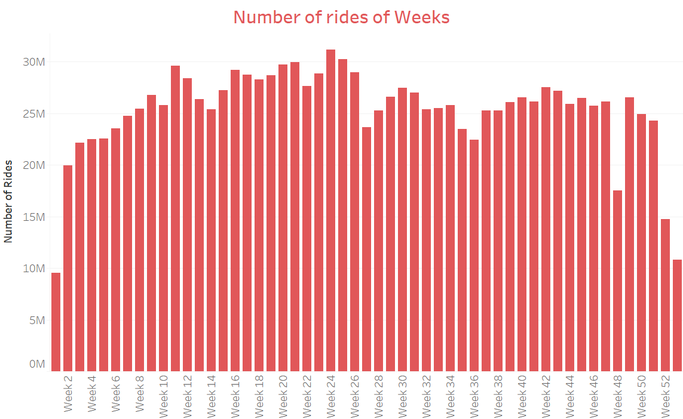

## [Overview](../index.md)

# Data Exploration

## [Preprocessing](../preprocessing/cleaning.md)

## [Feature Creation](../feature_creation/features.md)

## [Model Building](../model_building/model.md)

## [Conclusion](../conclusion/conclusion.md)

### Exploring Chicago Cab Data

The first step in this study is Exploratory data analysis of the cab data. Our aim is to analyze how different features in the data-set relates to the other variables. We want to identify the variables that have a predictive potency while predicting the daily and hourly revenues of the taxis. The visualization part was done in Tableau given the size of the dataset.

We begin by examining how Chicago cab business has changed over time, especially after the advent of the savvy competitors like Uber and Lyft. In Chicago, Uber and Lyft entered the cab business in 2011 and 2013 respectively.
We plot the Total Yearly pickups and Total Yearly Fare graphs. From the first graph, it can be noticed that there is a sharp decline in the number of pickups with an annual rate of 35% after 2014. Total revenues per year follows the same trend with the total cab business at $18 million in 2016 as opposed to $35 million in 2013. This suggests Uber and Lyft has a grasp on the customer base with their competitive prices. 

Solarized dark             |  Solarized Ocean
:-------------------------:|:-------------------------:
  |   

This has caused huge economic burden on the cabbies as they aren’t generating enough fares to keep up with their loan payments and meet their expenses. More than 350 foreclosure notices or foreclosure lawsuits have been initiated against medallion owners in the year 2017, compared to 266 in 2016 and 59 in 2015. Since October, lenders have filed lawsuits against at least 107 medallion owners who have fallen behind on loan payments, according to the union’s count. The major reason behind this financial distress is that since the emergence of Uber & Lyft, Cabbies face an uneven playing field with the ride-share companies, who typically don’t face the same permitting and fee rules. [1]

Let's plot the total number of rides against the week number over the course of 4 years. After looking at the graph, its difficult to explain the variation in the number of rides every week of the year. But, we can notice a spike in week 10 and week 24. A similar downward spike can be noticed in the week 48 and 52. Week 10 contains the most important holiday celebrated widely in Chicago City i.e. St. Patrick’s Day. Week 48 and week 52 contains Thanksgiving and Christmas holiday.

Holidays have always been special to the Chicago City. From raucous pub crawls to lively parades, there is nothing quite like St. Patrick's Day in Chicago. In March, Irish taverns are packed with revelers, jovial crowds jam the city streets and the Chicago River sparkles brilliant shades of emerald green. With so much going on, be it the downtown parade or dyeing of the Chicago river, Chicagoans travels a lot and they generally prefer public taxis.

It turns out that St. Patrick’s Day parade which is held in march of every year accounts for maximum number of taxi trips on a particular day.

One of the important national holiday is Labor Day, created to celebrate the contributions of the American worker. It falls on the first Monday of September, resulting in a dearly coveted three-day weekend. Labor Day is essentially a day off for cabbies and this results in less number of ride on that day.

Memorial Day, Thanksgiving and Christmas of every year has the least number of taxi trips respectively. This is again due to the fact that there are few Taxi’s in service on these holidays. This explicit visualization motivated us to incorporate important holidays as parameters in our predictive model. 
